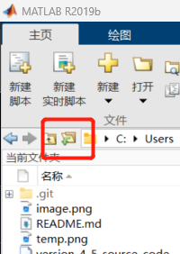

# 前言
这个项目是我和两位同学在*大三*的工程光学课程结课大作业，时隔多日，总算想起来有`Github`这个存放代码的绝佳仓库，遂上传到此。
# 安装教程
本项目仅支持<strong><span style='color:red'>Matlab2019b</span></strong>及以上，请留意。
 - 将本仓库克隆至本地，运行以下命令：
```bash
git clone git@github.com:BugBubbles/2D_FraunhoferDiffraction.git
```
 - 打开Matlab2019b，进入主页面，设置Matlab工作路径为本仓库，即选中下图按键：

    
    然后选择本仓库文件即可。设置完成后，左栏中将显示本项目全部文件。
 - 选择`主页>>打开>>version_4_5.mlapp`，成功打开后的页面如下图所示：
    
 - 单击启动按键，可进入如下用户界面：
    
到此完成全部安装工作，即可运行对应指令，运行结果演示可参考[B站链接](https://www.bilibili.com/video/BV1UL4y1p7xw/?spm_id_from=333.1296.top_right_bar_window_default_collection.content.click&vd_source=cd74b6735f3ed1f941178cd9cb9c5743)。
ps：在运行过程中，matlab会在当前工作目录下生成一个temp.png文件并暂时锁定，关闭软件和matlab后，可自行删除该文件。
# 背景介绍
通俗上讲，光的衍射可定义为光能绕开物体，在边缘处发生不沿直线传播的现象，实际上这一定义反映了衍射的最直观印象，即衍射发生在光的传播路径之外，1690年惠更斯提出假设“波面上的每一点都可以看作为一个发出球面子波的次级扰动中心，在后一个时刻这些子波的包络面就是该时刻的新的波面”，初步建立起点光源的衍射理论基础。菲涅耳用干涉原理完善了该定义，即“惠更斯子波来自于同一光源，它们是相干光束，波面外任意一点的光振动为该波面上全部子波在该处振动的相干叠加”。后人（基尔霍夫）把这两位的论述建模为严格的计算公式，即：
$$
\bm{E}(P)=\frac{A}{i\lambda}\iint_\Sigma\frac{\exp(ikl)}{l}\frac{\exp(ikr)}{r}\Big[\frac{\cos<\vec{n},\vec{r}>-\cos<\vec{n},\vec{l}>}{2}\Big]d\Sigma
$$
式中，$k$是波数，即$k=\frac{2\pi}{\lambda}$，$\Sigma$是平面衍射孔，$l$是光源点到某点P的距离，$r$是光源点到衍射孔某一点Q的距离，$<,>$表示两个矢量的夹角，矢量从光源出发，到达对应的目标点。
## 夫琅禾费衍射
直接使用基尔霍夫公式计算涉及到复杂的矢量运算，通常只有理论分析意义，为了便于工程应用，人们引入了两种简化模型，一种是菲涅耳衍射模型，即光源点的近场衍射。另一种应用更为广泛，即在距离光源点较远的情况下，光源发出的波束认为是平行光，若孔径的线度与观察者到孔径的距离相比足够小，则此时所得衍射结果称为夫琅禾费衍射，也称远场衍射模型。
由于观察者距离孔径和光源都足够遥远，光源发光、衍射光都可以认为是平行光，远场衍射模型的原理式可由下式给出：
$$
\widetilde{\bm E}(x,y)=\frac{\exp(ikz_1)}{z_1}\exp\Big[\frac{ik}{2z_1}(x^2+y^2)\Big]\iint_{-\infty}^{+\infty}\widetilde{\bm E}(x_1,y_1)\exp\Big[-i2\pi\big(x_1\frac{x}{\lambda z_1}+y_1\frac{y}{\lambda z_1}\big)\Big]\mathrm{d}x_1\mathrm{d}y_1
$$
式中,脚标为1的坐标指的是以观察者平面为原点建立坐标系，从观察者向衍射屏观测得到的坐标值。
## 从衍射到傅立叶光学
取定$\displaystyle u=\frac{x_1}{\lambda z_1}$，$\displaystyle v=\frac{y_1}{\lambda z_1}$，上式改写为：
$$
\widetilde{\bm E}(x,y)=\frac{\exp(ikz_1)}{z_1}\exp\Big[\frac{ik}{2z_1}(x^2+y^2)\Big]\iint_{-\infty}^{+\infty}\widetilde{\bm E}(x_1,y_1)\exp\Big[-i2\pi\big(x_1u+y_1v\big)\Big]\mathrm{d}x_1\mathrm{d}y_1
$$
其中，积分符号以外的指数项均带有单位虚数$i$，说明该项只影响光振动分布的相位，对计算光强度分布没有影响，从光振动计算光强度分布的公式为：
$$
I(x,y)=\widetilde{\bm E}(x,y)\cdot\widetilde{\bm E}^*(x,y)=\int_{0}^{T}\bm{E}(x,y)\cdot\bm{E}^*(x,y){\rm d}t
$$
可见是在时间上进行积分，因此该相位项在积分过程中会略去，孔径面上的复振幅分布为$\widetilde{\bm E}(x_1,y_1)$，因此上式简写为：
$$
\widetilde{\bm E}(x,y)=C_{xy}\iint_{-\infty}^{+\infty}\widetilde{\bm E}(x_1,y_1)\exp\Big[-i2\pi\big(x_1u+y_1v\big)\Big]\mathrm{d}x_1\mathrm{d}y_1
$$
此式也就是二维傅立叶变换的形式，说明夫琅禾费衍射就是对衍射孔处光束复振幅的二维傅立叶变换结果。这为我们的项目提供了理论支持。
# 工程实现
由于matlab闭源，代码文件不是脚本，我这里把代码复制出来，放置在[这里](https://github.com/BugBubbles/2D_FraunhoferDiffraction/blob/main/version_4_5_source_code)供大家参考。
## 代码框架
利用Matlab的APP编辑器，在Matlab环境中运行。代码框架完全封装在Matlab内部，只调用了其开放的API接口，完成了整个软件的搭建。
 - `Properties (Access = )`：属性接口，用于定义全局回调函数变量，可以公开也可以私有，如果是公有，则全体回调函数**共享**这个变量值（<strong><span style='color:red'>不是继承</strong></span>自这个变量值），注意使用`end`结束当前命名空间。
 - `function`：函数接口，主要分为两类函数，一类是回调函数，用于和界面交互，参与数据流的输入输出；一类是普通函数，用于正常执行计算分析功能。
### 回调函数输入
界面中，每一个按键、滑动条和绘图坐标都是一个可回调项，回调函数的定义语法与其他函数一样，请留意，函数名与对应的组件名保持一致，在右侧大纲中可编辑当前回调组件名称：
可以通过在组件设计界面右键查看该组件对应回调：
在代码页，可编辑该回调函数回调事件，例如：
可在右侧栏中定义回调组件的初始值，即未有任何事件时的显示状态：
回调函数的定义形式如下：
```matlab
function my_func_callback(app, event)

% your code here

end
```
当用户操作触发该组件事件时，回调函数将被触发并执行一次功能，例如点击一下按键，按键对应的回调函数便运行一次该函数命名域下的代码。在文本框输入一个参数并回车确定时，文本框首先将传入对应的输入参数，这个参数一般名称为`app.ItemName.Value`，然后再运行一次对应的代码，滑动条、标签页也是如此，不再赘述。值得注意的是，坐标栏并没有直接回调属性可供获取。在我们的软件实现中，有一个功能是在坐标栏上取点画图，这个功能的实依靠的是`get`函数，即该函数能够获取当前UI内鼠标点击的位置，简单的使用示例如下：
```matlab
tmp=get(app.UIAxes,'currentpoint');     %get current clicking xy
```
每点击一下，`tmp`变量就获得一个行向量坐标值，之后可进行其他操作。
### 回调函数输出
回调函数的输出，仍然是通过其属性实现，更改按键的名称可通过修改`app.KeyName.Text`属性，输出提示框可使用`errorlog`函数，唯一复杂一点的是图像的显示，可通过`plot`函数向某一坐标栏输出，如下实现：
```matlab
plot(app.UIAxes,app.cx,app.cy,'Color',[1 0 0],...
                    "Marker","o","LineStyle","none"); %draw a point into UIAxes
```

在充分利用回调函数的基础上，可以实现一系列的复杂功能，例如按键提示、鼠标触点反馈、甚至是选中点擦除（囿于时间关系我们没有实现这个点擦除的功能，因为它和光的衍射相去甚远）。
## 关键算法
本项目最关键的算法的快速傅里叶变换，所幸这个功能已经有前人实现，我们完全不需要重新造轮子，简单地调用函数接口`fft2`和`fftshift`就可以实现二维快速傅立叶变换。然后，对变换得到的频谱进行能量积分，即在频谱上体现为计算其幅值，调用一次`abs`函数即可。
### 填充算法
二维傅立叶变换是对图像进行运算，因此选点结束绘制得到的折线图不能参与变换，而应该将其填充为模板图像。这里我们选用的关键算法是cv领域常见的形态学填充算法，即将折线经过的点进行多次闭操作（先膨胀再溶蚀），直到前后两次操作之后图像的差小于某一阈值为止，该算法实现原理简单，matlab也提供了对应的API，即`imfill`函数。填充算法本身没有问题，但是我们没有限制前后选点的位置关系，因此完全有可能出现“8”次形的交叉填充结果。

这里，解释一下工作路径下生成`temp.png`的原因，因为绘制的折线并不能直接作为`imfill`函数的输入值，该函数只接受图像输入，因此我们将当前折线图保存为图形文件，在需要填充时调用这个图形文件进行图像处理，即可实现填充功能。
### 曲线绘图算法
在项目中有一个标签页是“闭合曲线孔”，程序将自动从用户选中的几个散点中拟合成一个闭合图形，曲线绘图不似折线图，可以直接逐点连接，曲线图需要基于现有的坐标点，根据一定的规律进行插值补充，使图形边界光滑。这里，我们设计了极坐标插值法，能够满足以上需求：
 - 获取全部点的坐标，对其进行归中操作（即减去平均值），然后保留质心；
 - 并按极角的角度大小重排序；
 - 使用三次平滑插值，自变量为极角，因变量是极径；
 - 按极角顺序绘制图像。
该方法简单、易于实现，图像光滑圆润，避免出现扭曲缠绕的插值结果，但是也损失了一定的画图效果，不能做到想啥画啥，究其原因，是当时没有学习二维曲线的插值法（样条曲线插值）。
### 复色光算法
衍射有一个选项是白光衍射，白光是一系列光谱的叠加，在这里，我们简单地处理为赤橙黄绿青靛紫七种基本色光的叠加（实际上这并不准确，光束存在一定的谱线宽度，不同波长处的光线强度不是定值）。换言之，只需要对某一孔进行七次衍射计算，然后将之结果线性叠加起来（这里的线性叠加是有理论依据的，白光相干长度极短，不同颜色的光波列差已经远远超出了白光的相干长度，因此它们必然是不相干的，其光强分布满足光的独立传播定律）。

# 小结
本项目实现了用二维傅立叶变换求解光的夫琅禾费衍射，实现了图形可视化效果和自定义图像绘制功能。

# 友链
Bilibili演示结果：[https://www.bilibili.com/video/BV1UL4y1p7xw/?spm_id_from=333.1296.top_right_bar_window_default_collection.content.click&vd_source=cd74b6735f3ed1f941178cd9cb9c5743](https://www.bilibili.com/video/BV1UL4y1p7xw/?spm_id_from=333.1296.top_right_bar_window_default_collection.content.click&vd_source=cd74b6735f3ed1f941178cd9cb9c5743)